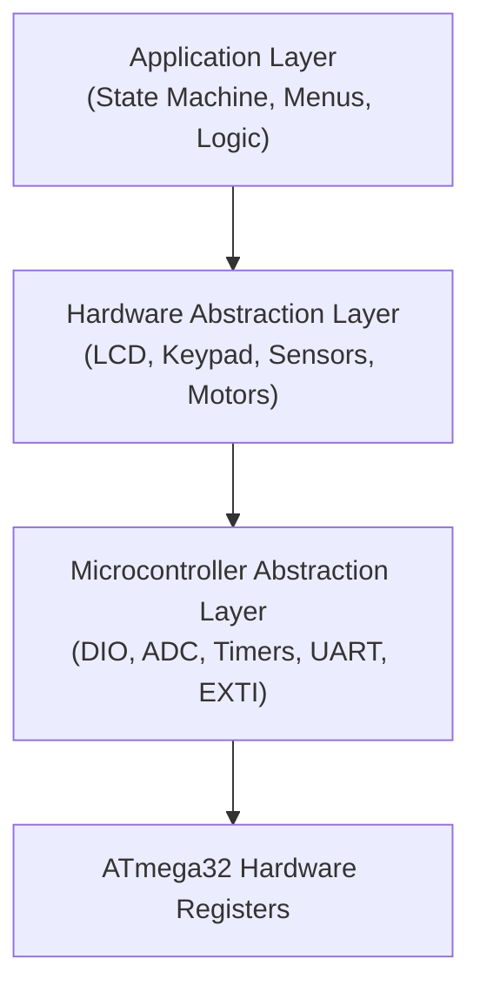
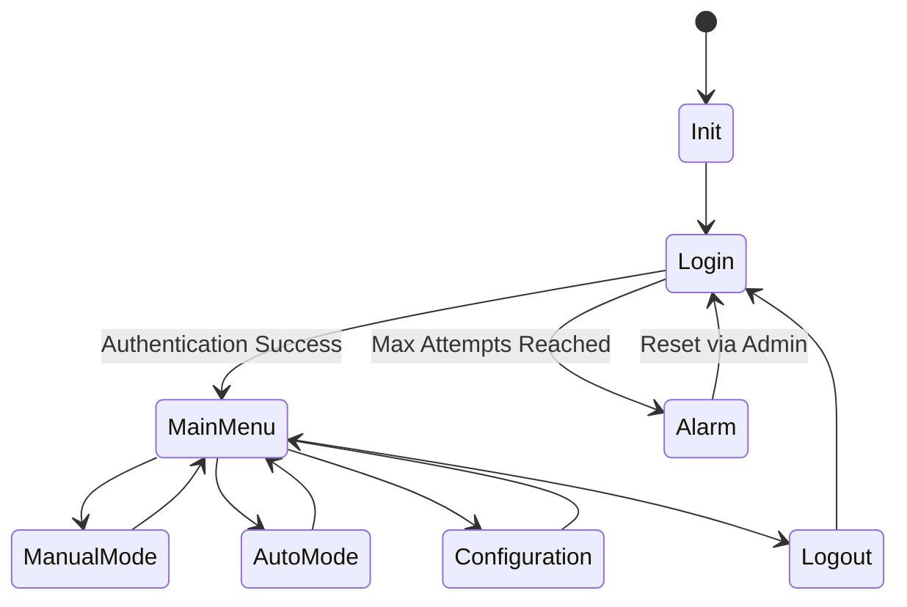
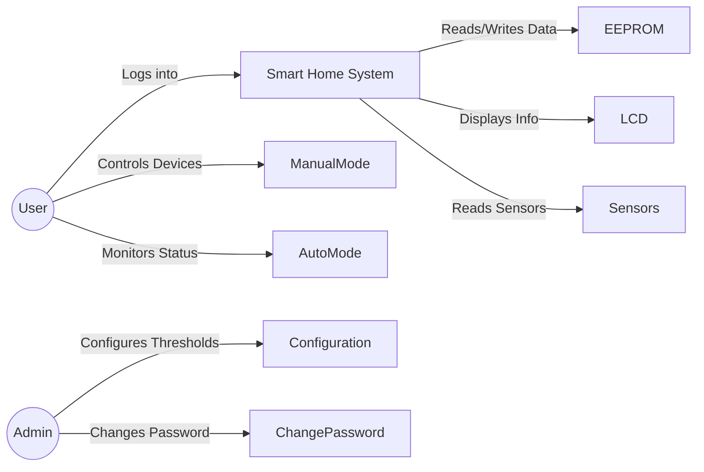
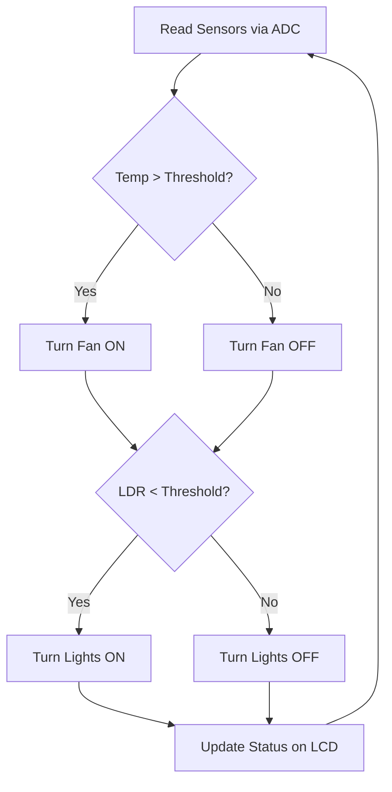

# 🏠 Smart Home Controller

### AVR Embedded Systems Graduation Project

---

**ATmega32 | Embedded C | Layered Architecture | State Machine | Driver Development**

---

# 🚀 Message from the Team Leader

**Hello Team,**

Welcome to the **Smart Home Controller** project! As your Team Leader, I want to set a clear vision for what we are going to build. Our objective is to develop a highly configurable and robust embedded control system. This system will empower users to monitor and control various home devices via a local user interface, while intelligently supporting automatic operating modes and critical alarm conditions.

This project is a great opportunity for us to apply everything we've learned about **Embedded C, Microcontroller Architecture, and Software Engineering**. We will be implementing a professional **Layered Architecture (MCAL, HAL, APP)**, utilizing a **State Machine** for our core logic, and writing clean, reusable drivers.

The expectations are high. We need to pay attention to details, from writing efficient drivers to ensuring the system responds in real-time without failure.

**Important Note:** Before we move to the physical hardware, we will design and simulate the entire circuit using **Proteus Professional**. This will help us test our firmware safely and ensure everything is connected properly.

Below you will find the comprehensive project specifications, system diagrams, and the exact modules we need to deliver. Let's collaborate closely, divide the tasks effectively, and build a masterpiece!

*— Hesham Ahmed, Team Leader*

---

# 📋 Table of Contents

1. [Project Overview](#project-overview)
2. [Functional Requirements](#functional-requirements)
3. [Non-Functional Requirements](#non-functional-requirements)
4. [System Architecture &amp; Layers](#system-architecture--layers)
5. [Hardware Components](#hardware-components)
6. [ATmega32 Pin Assignment](#atmega32-pin-assignment)
7. [Modules &amp; Drivers to Develop](#modules--drivers-to-develop)
8. [System Diagrams](#system-diagrams)
   * [State Machine](#state-machine)
   * [Use Case Diagram](#use-case-diagram)
   * [Automatic Mode Flow](#automatic-mode-flow)
9. [Memory Layout](#eeprom-memory-layout)
10. [Project Organization &amp; Team](#project-organization--team)

---

# 📖 Project Overview

The Smart Home Controller is a complete embedded system built around the **ATmega32 AVR Microcontroller**. The project simulates a real smart home environment where users can authenticate themselves, monitor sensors, control devices, configure system settings, and store persistent data inside EEPROM.

---

# ⚙️ Functional Requirements

Our system must implement the following core functionalities:

## 1. User Authentication

* **Password Protection:** The system must be locked by default.
* **Maximum Attempts:** After 3 consecutive failed login attempts, the system must trigger a security alarm.
* **Persistent Storage:** Passwords must be securely stored in the EEPROM so they are not lost during power resets.

## 2. Operating Modes

### Manual Mode

The user must be able to manually control the following via the system interface:

* Room Lights
* Fans/AC Units
* Door Locks
* Alarm toggling

### Automatic Mode

The system must automatically control devices based on sensor readings:

* **Temperature:** If `Temperature > Threshold`, automatically turn on the Fan.
* **Light Level:** If `LDR Level < Threshold`, automatically turn on the Room Lights.

## 3. System Configuration

An Administrator menu must be available to configure:

* System Password
* Temperature Thresholds
* Light Level Thresholds
* Enabling/Disabling the Alarm System
* Switching between Manual and Automatic modes

## 4. Alarm System

The system must immediately trigger alarms under these conditions:

* Fire detection (via sensors or external interrupt).
* Wrong password entered multiple times.
* External emergency push button pressed.

## 5. Event Logging

We must log critical events into the EEPROM for auditing:

* Successful/Failed Logins
* Alarm Trigger Events
* Configuration Changes

## 6. Real-Time Response & Status Monitoring

* Fast processing of inputs (Keypad, ADC sensors).
* Continuous display updates on the LCD.
* UART Debugging: Send sensor readings and error messages to a PC terminal.

---

# 🛡️ Non-Functional Requirements

To ensure a professional software product, the team must adhere to:

* **Modular Design:** Strictly follow the Layered Architecture (MCAL -> HAL -> APP).
* **Code Reusability:** Write drivers that are portable and independent of the application logic.
* **Interrupt-Driven Approach:** Avoid blocking code (Delays) as much as possible; utilize Timers and External Interrupts.
* **Memory Optimization:** Keep RAM consumption low.
* **Coding Standard:** Follow standard naming conventions and MISRA C guidelines where applicable.
* **Doxygen Documentation:** All source files, functions, and macros **must** be documented using the **Doxygen** comment style. Every driver file must include a file header block, and every function must have a description, `@param`, and `@return` tags.

---

# 🏗️ System Architecture & Layers

---

# 🔌 Hardware Components

| Component                 | Purpose / Function in Project              |
| :------------------------ | :----------------------------------------- |
| **ATmega32**        | Main Microcontroller (Brain of the system) |
| **LCD 16x2**        | Main User Interface Display                |
| **Keypad 4x4**      | User Input (Passwords, Menu Navigation)    |
| **LM35 Sensor**     | Temperature Monitoring                     |
| **LDR Sensor**      | Ambient Light Monitoring                   |
| **LEDs / Relays**   | Lighting & Heavy Load Control (e.g., Fans) |
| **Buzzer**          | Alarm System Audio Output                  |
| **Push Button**     | Emergency / External Interrupts            |
| **Internal EEPROM** | ATmega32 Internal Non-Volatile Memory      |

---

# 📌 ATmega32 Pin Assignment

To ensure everyone is on the same page while designing the Proteus schematic and writing the MCAL drivers, here is the unified hardware pin mapping for our ATmega32 microcontroller:

| Port            | Pin            | Hardware Component      | Description                         |
| :-------------- | :------------- | :---------------------- | :---------------------------------- |
| **PORTA** | `PA0` (ADC0) | **LM35 Sensor**   | Temperature Analog Input            |
|                 | `PA1` (ADC1) | **LDR Sensor**    | Light Analog Input                  |
|                 | `PA2`        | **LED**           | Room Lights Output                  |
|                 | `PA3`        | **Relay**         | Fan / AC Output                     |
|                 | `PA4`        | **Relay**         | Door Lock Output                    |
|                 | `PA5`        | **Buzzer**        | Alarm Audio Output                  |
| **PORTB** | `PB0-PB3`    | **Keypad (Rows)** | Output to Keypad Rows               |
|                 | `PB4-PB7`    | **Keypad (Cols)** | Input from Keypad Columns (Pull-up) |
| **PORTC** | `PC0`        | **Free**          | Available for future use            |
|                 | `PC1`        | **Free**          | Available for future use            |
|                 | `PC2`        | **LCD RS**        | Register Select                     |
|                 | `PC3`        | **LCD EN**        | Enable (Note: Connect RW to GND)    |
|                 | `PC4`        | **LCD D4**        | Data Line 4 (4-bit mode)            |
|                 | `PC5`        | **LCD D5**        | Data Line 5 (4-bit mode)            |
|                 | `PC6`        | **LCD D6**        | Data Line 6 (4-bit mode)            |
|                 | `PC7`        | **LCD D7**        | Data Line 7 (4-bit mode)            |
| **PORTD** | `PD0` (RXD)  | **UART**          | Receive Data (from PC terminal)     |
|                 | `PD1` (TXD)  | **UART**          | Transmit Data (to PC terminal)      |
|                 | `PD2` (INT0) | **Push Button**   | Emergency Stop / Alarm Trigger      |

> **Action Item for the Hardware Team:** Please strictly follow this mapping when building the Proteus simulation. This guarantees our software drivers (DIO, ADC, etc.) will perfectly match the hardware without integration conflicts.

---

# 🛠️ Modules & Drivers to Develop

The team needs to develop the following modules from scratch.
*(Note: Tasks will be divided among the team members)*

### MCAL (Microcontroller Abstraction Layer)

* `DIO`: Digital Input/Output operations.
* `ADC`: Analog to Digital Conversion (Polling & Interrupt based).
* `UART`: For debugging and system logging to a PC terminal.
* `Timers`: For system ticks, delays without blocking, and PWM for fan speed control.
* `EXTI`: External Interrupts handling.
* `Internal EEPROM`: ATmega32 internal memory read/write operations.

### HAL (Hardware Abstraction Layer)

* `LCD Driver`: Alphanumeric display control.
* `Keypad Driver`: Matrix keypad scanning.
* `LED Driver`: Room lights indication and control.
* `Relay Driver`: Heavy load control (Fan/AC and Door Lock).
* `Buzzer Driver`: Alarm system audio generation.
* `Push Button Driver`: External button reading (Polling/Interrupt).
* `Sensor Drivers`: Temperature (LM35) and Light (LDR).

### APP (Application Layer)

To keep the application logic organized and clean, we will divide the APP layer into the following sub-modules:

* `Main State Machine (Scheduler)`: The core loop managing system states (Init, Login, Menu, Manual, Auto, Alarm).
* `Authentication Manager`: Handles password validation, tracking failed attempts, and EEPROM password updates.
* `UI & Menu Manager`: Manages LCD screen transitions, configuration menus, and Keypad inputs.
* `Mode Controller (Manual/Auto)`: Implements device control logic based on user commands or sensor thresholds.
* `Sensor Processing`: Converts raw ADC values into meaningful physical readings (e.g., Celsius).
* `Alarm & Event Handler`: Triggers emergencies and handles logging critical events to the EEPROM.

---

# 📊 System Diagrams

## State Machine

## Use Case Diagram

## Automatic Mode Flow

---

# 💾 EEPROM Memory Layout

To ensure data integrity, we will standardize our EEPROM addresses:

| Address             | Data Stored                      |
| :------------------ | :------------------------------- |
| `0x00` - `0x03` | Admin Password (4 Digits)        |
| `0x10`            | Temperature Threshold Value      |
| `0x20`            | Light (LDR) Threshold Value      |
| `0x30`            | System Mode (0: Manual, 1: Auto) |
| `0x40`            | Alarm Enable/Disable Flag        |
| `0x50` - `0x90` | Event Log History                |

---

# 👥 Project Organization & Team

We will be following an Agile approach, tracking our tasks and ensuring every layer is thoroughly tested before integration.

| Role                  | Name                                    |
| :-------------------- | :-------------------------------------- |
| **Coordinator** | **Yasseen Ahmed ELSayed**         |
| **Team Member** | **Khaled Mohamed Hamdy Elroumy**  |
| **Team Member** | **Soha Hossam**                   |
| **Team Member** | **Roaya Ali El sayed Ali Badran** |
| **Team Member** | **Maryam Mohamed Sameh Salah**    |

---
